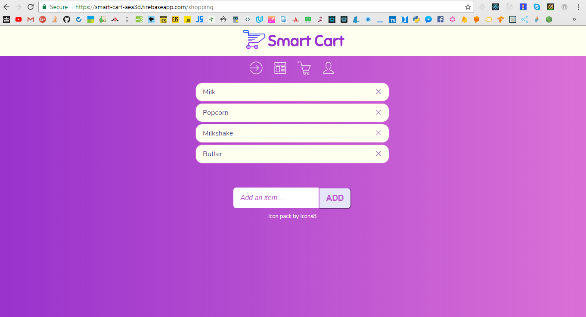

# Smart Cart - React & Firebase demo app
## Summary

Smart Cart is a simple *CRUD* app. It was created with the intention to explore the minimum requirements  needed to setup a **[React.js](https://reactjs.org/)** app and integrate it with the **[Firebase](https://firebase.google.com/)** :fire: back-end solution.

Smart Cart  can be used as a web based grocery shopping list tool. It lets you add items to your *shopping cart* on your mobile device when on the go. You can also use it from the comfort of your home when planning your shopping list on a laptop's web browser.

**The app is by no means complete. Many features still need to be added to make it a viable solution. As an example, you can “Sign up” and sign in. However, the facility to change your password is missing.**

## Setup
### Setting up requires access to [Firebase](https://firebase.google.com/). We will be using the Real-time database and Authentication in this project.
1. Clone or download this project
2. Create your app with [create-react-app](https://github.com/facebook/create-react-app/blob/master/packages/react-scripts/template/README.md)
3. Copy the **src** directory to your newly created project
4. In the **src/firebase** folder, create a firebase.js file
5.  Add the following code to firebase.js: (replace the dummy values with the your unique values provided by Firebase)
```javascript
import * as firebase from 'firebase'

const config = {
  apiKey: 'YOUR GIVEN APP_KEY',
  authDomain: 'YOUR GIVEN AUTH_DOMAIN',
  databaseURL: 'YOUR GIVEN DATABASE_URL',
  projectId: 'YOUR GIVEN PROJECT_ID',
  storageBucket: 'YOUR GIVEN STORAGE_BUCKET',
  messagingSenderId: 'YOUR GIVEN MESSAGING_SENDER_ID'
}

if (!firebase.apps.length) {
  firebase.initializeApp(config)
}

const auth = firebase.auth()
const db = firebase.database()

export { auth, db }
```

Don't forget to add the dependencies to your package.json file in the root of your project.
After that, you're good to go :relaxed:
Extend the app to add more functionality like changing password, for example :+1:

## Sample Screenshot

***
##### Licensed under the [MIT License](LICENSE)
